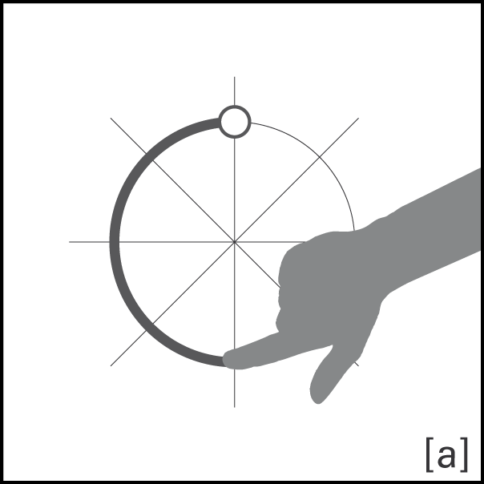
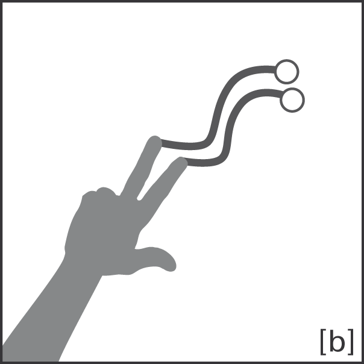
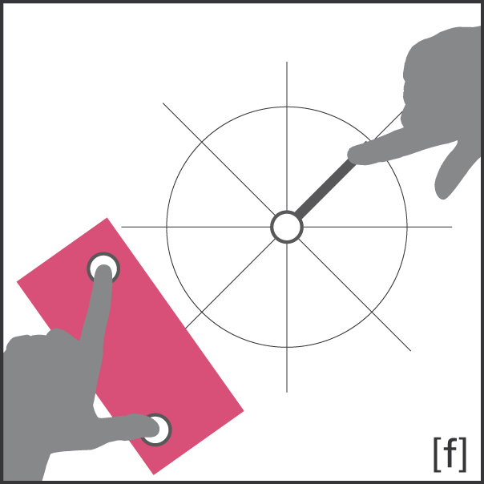

The grammar to describe multi-touch gestures is based on a basic mathematical syntax. The syntax has six key elements:

* Performed movement
* Number and shape of touch contacts
* Temporal relations
* Spatial relations
* Focus objects
* Distinction in online or offline processing

The following Extended Backus Naur Form (EBNF) defines the GeForMT language.

~~~ vim
definition ::= id '=' complex ('|' complex)*[':'time]';'
id ::= [A-Za-z0-9]+
complex ::= gesture (operator gesture)* | relation'['gesture (operator gesture)*']'
gesture ::= function'('atomfocus(','atomfocus)*')' | atomfocus(','atomfocus)*
atomfocus ::= atom | atom'('focuslist')'
focuslist ::= id(','id)*
function ::= [integer]'F' | [integer]'H' | [integer]'B'
operator ::= '*' | '+' | ',' | ';'
relation ::= 'SYNC' | 'JOIN' | 'SPLIT' | 'CROSS' | 'CONNECT_START' | 'CONNECT_END' | 'ASIDE' | 'AMONG' | 'CLOSE' | 'ADJOIN_'direction
atom ::= identifier | vector['_'direction] | shape['_'direction['_'rotation]
identifier ::= 'MOVE' | 'POINT' | 'DEPOINT' | 'HOLD'
vector ::= 'LINE'
shape ::= 'CIRCLE' | 'SEMICIRCLE'
direction ::= 'NORTH' | 'N' | 'NORTHEAST' | 'NE' | 'EAST' | 'E' | 'SOUTHEAST' | 'SE' | 'SOUTH' | 'S' | 'SOUTHWEST' | 'SW' | 'WEST' | 'W' | 'NORTHWEST' | 'NW' | 'S~' | 'W~' | 'N~' | 'E~'
rotation ::= 'CLOCKWISE' | 'CW' | 'COUNTERCLOCKWISE' | 'CCW'
integer ::= [1-9][0-9]*
time ::= 'ON' | 'OFF'				
~~~
		
GeForMT gestures are centered on a compass rose and feature basic atomic building blocks such as freeforms, lines, circles, and semicircles. Below is a set of example gestures to show the features of the language. Gestures can also be constrained regarding their direction and rotation. Furthermore, successive and parallel gesture strokes of a gesture can have temporal and spatial constraints.

|---
| Gesture | Expression | Description
|-|-|-|
| {:style="min-width: 120px; border-radius: 0px"} | `1F(SEMICIRCLE_S_CCW)` | The type of contact with the surface is described by function around an atomic gesture. In this case, one finger (1F) is used to draw a semicircle which is drawn towards the south of the compass rose in a counterclockwise fashion. Other contact types maybe a hand (1H) or arbitrary blobs (1B) depending on the hardware in use. |
| {:style="min-width: 120px; border-radius: 0px"} | `2F(MOVE)` | In this example, a gesture with two fingers (2F) performs a free movement (MOVE). |
| ![GeForMT Gesture for CONNECT_START[1F(LINE_SW;LINE_SE)]](../assets/images/CONNECT_START_1F_LINE_SW_LINE_SE.png){:style="min-width: 120px; border-radius: 0px"} | `CONNECT_START[1F(LINE_SW; LINE_SE)]` | Spatial constraints as in this example serve to disambiguate synchronous or sequential gesture strokes. In this example, two independent gesture strokes that are performed with lifting the finger which is defined by a semicolon (LINE_SW and LINE_SE) are constrained to start at the same initial location. Otherwise, no caret would result. |
| ![GeForMT Gesture for SPLIT[1F(LINE)*1F(LINE)]](../assets/images/SPLIT_1F_LINE_1F_LINE.png){:style="min-width: 120px; border-radius: 0px"} | `SPLIT[1F(LINE)*1F(LINE)]` | Synchronously performed gestures strokes that are concatenated using the star or multiplication sign can also be constrained regarding their spatial relation. In this example, a zoom gestures is defined by applying the SPLIT constraint. The reverse operation would be defined with the JOIN constraint. |
| ![GeForMT Gesture for CROSS[1F(LINE_S;LINE_E)]](../assets/images/CROSS_1F_LINE_S_LINE_E.png){:style="min-width: 120px; border-radius: 0px"} | `CROSS[1F(LINE_S;LINE_E)]` | Another spatial relation is the crossing of successive gesture strokes, similar as in the third example. |
| {:style="min-width: 120px; border-radius: 0px"} | `2F(HOLD(object))+1F(LINE)` | An object focus can be assigned to a gesture explicitly by appending the name of an object in parantheses to an atomic gestures stroke. In this example, two fingers are held on an object first. By using the plus sign, we define an asynchronously starting second line gesture. |
|---