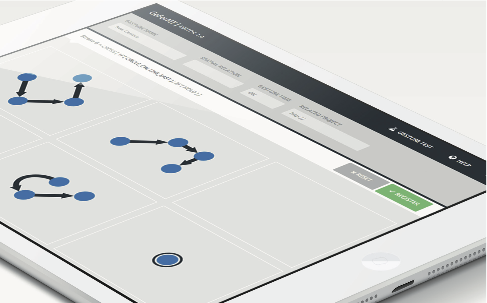

Gesture Formalization for Multitouch -- or short GeForMT -- is a domain specific language, which describes multi-touch gestures. GeForMT proposes a reasonably detailed set of gesture building blocks while hiding as many concrete parameters and implementation details as possible. The design goals are:

* Concise and clear to read for humans
* Formal definition for platform-independent use
* Quick implementation by embedding in code
* Support of direct manipulation (online gestures) and stroke shortcuts (offline gestures)

On this website you can retrieve the JavaScript implementation GeForMTjs and get further information including example gesture sets.